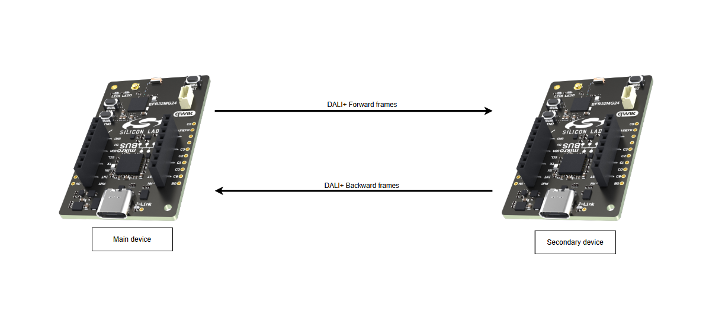
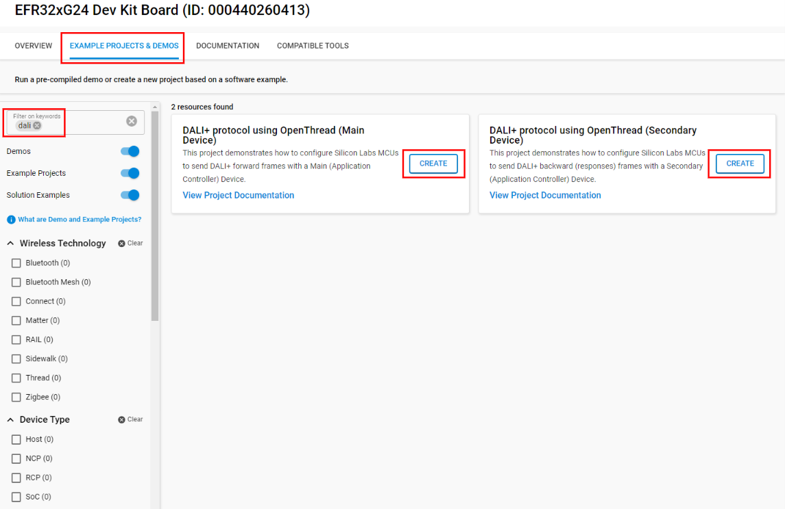
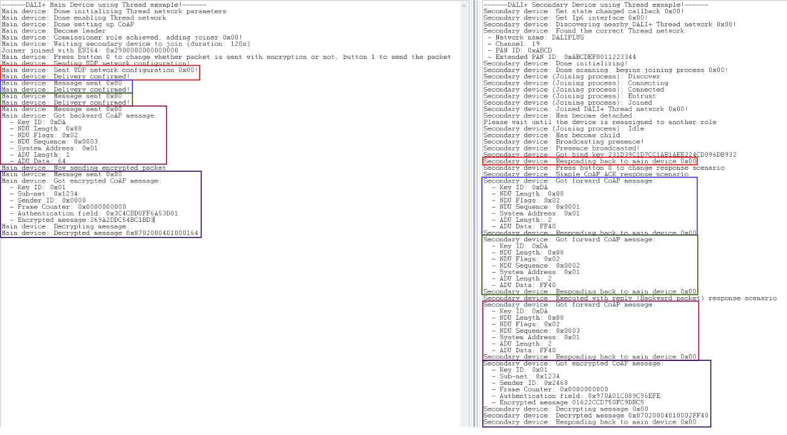

# OpenThread - DALI+ Communication #

## Summary ##

These projects are updated to support DALI+ over OpenThread. DALI+ is an extension of the DALI (Digital Addressable Lighting Interface) protocol that operates over wireless IP-based networks. Instead of traditional DALI communication using Manchester encoding, DALI+ transmits its messages over OpenThread, an IPv6-based mesh networking protocol. This project demonstrates how to configure Silicon Labs MCUs to send DALI+ frames between a Main device and a Secondary device over Thread network.

## SDK Version ##

- [SiSDK v2024.12.0](https://github.com/SiliconLabs/simplicity_sdk/releases/tag/v2024.12.0)

## Hardware Required ##

Two Thread capable devices from Silicon Labs. Tested boards for working with this example:

| Board ID | Description  |
| ---------------------- | ------ |
| BRD2703A | [EFR32xG24 Explorer Kit-BRD2703A](https://www.silabs.com/development-tools/wireless/efr32xg24-explorer-kit?tab=overview) |
| BRD2601B | [xG24 Dev Kit- BRD2601B](https://www.silabs.com/development-tools/wireless/efr32xg24-dev-kit?tab=overview)    |

## Connections Required ##

The DALI+ system runs over an OpenThread mesh network, where:

- The Main device is the Leader that sends forward frames over the OpenThread network, while waiting for the backward frames from the secondary device.
- The Secondary devices shall receive the forward frames and send backward frames as responses.

## Setup ##

### Create a project based on an example project ###

1. From the Launcher Home, add your hardware to My Products, click on it, and click on the EXAMPLE PROJECTS & DEMOS tab. Find the example project with the filter "dali".

2. Choose corresponding project for Main Device and Secondary Device -> click Create and Finish and Project should be generated.

3. Build and flash this example to the board.

   

### Start with an "Empty C" project ###

1. Create a Empty C project for your hardware using Simplicity Studio v5.

2. Copy the **inc**, **src** folders, and the **app.c** into the project root folder (overwriting existing file):
    - With **Main Device**: [main_device](src/main_device)
    - With **Secondary Device**: [secondary_device](src/secondary_device)

3. Install the software components:
    - Open the .slcp file in the project.
    - Select the SOFTWARE COMPONENTS tab.
    - Install the following components for Main Device:
        - [Application] → [Utility] → [Log]
        - [OpenThread] → [Stack(FTD)]
            - Open Stack (FTD) configuration and enable CoAP API and Commissioner
        - [Platform] → [Driver] → [Button] → [Simple Button]
            - Instance: btn0 and press the Add New Instances for another instance: btn1
        - Navigate [Platform] → [Security] → [Configuration]
            - Open the configuration and enable PSK based ciphersuite modes in SSL / TLS and ECDHE-ECDSA based ciphersuite modes in SSL / TLS
    - Install the following components for Secondary Device:
        - [Application] → [Utility] → [Log]
        - [OpenThread] → [Stack(FTD)]
            - Open Stack (FTD) configuration and enable CoAP API and Joiner
        - Navigate [Platform] → [Security] → [Configuration]
            - Open the configuration and enable PSK based ciphersuite modes in SSL / TLS and ECDHE-ECDSA based ciphersuite modes in SSL / TLS
        - [Platform] → [Driver] → [Button] → [Simple Button]
            - Instance: btn0
    - [Platform] → [Utilities] → [Circular Queue] → [Configuration]
        - Increase Max Queue Length to 16

4. Build and flash the project to your device.

**NOTE:** For those who want to debug with No Optimization option, navigate to **config/sl_memory_manager_region_config.h** and increase the SL_STACK_SIZE to 8192.

## How It Works ##

1. The Main Device initiates a new Thread network with a custom operational dataset, becoming the Leader and Commissioner. It then adds the Secondary Device as a Joiner using a pre-shared key, with a 120-second window for joining. The Secondary Device starts by discovering the Thread network created by the Main Device. If successful, it proceeds with the Joiner process; otherwise, it retries the discovery.

2. Once the Commissioner/Joiner process is complete and the **Secondary Device** is reassigned from the detached state, it will multicast a UDP discovery packet to the **Main Device**. The **Main Device** will respond with a UDP network configuration packet to set the **Secondary Device's** non-volatile parameters. The **Secondary Device** will then send a CoAP ACK to confirm the configuration.
    - In DALI+, there are 3 main CoAP responses:
        - Not executed, CoAP ACK: CoAP code “valid”, this shall response with a CoAP ACK
        - Executed, no reply values: CoAP code “changed”, this shall response with a UDP simple ACK packet with error indicator
        - Executed, has reply values: CoAP code “content”, this shall response with a backward UDP packet with data
    - Executed shall mean minimum one command frame in the original forward frame transaction has been executed or forwarded to another network. Depending on the transaction type, an executed forward frame transaction not leading to any reply values may still require a simple acknowledgment frame to be send.

3. The **Main Device** transmits forward packets to the **Secondary Device**, which responds with one of the three responses mentioned above. All packets adhere to the DALI+ frame specifications. For detailed information, refer to "Part 104 Changes and Additions" and the "IEC 62386 Standards".

## Testing ##

To conduct testing, you will require two Silicon Labs boards: one designated as the Main Device and the other as the Secondary Device.

1. Power on the **Main Device** first to initiate the commissioner before the joiner from the Secondary Device. Note that the commissioning phase lasts only 120 seconds, and the joiner must be active within this period. If not, the entire process must be restarted.

2. Open a terminal program (such as the built-in console in Simplicity Studio) for each board.

3. On the **Secondary Device**, press **Button 0** to cycle through the response scenarios as previously described. On the Main Device, press **Button 1** to send the forward packet (limited to 40 packets per 10 seconds, in compliance with DALI+ requirements). Press **Button 0** to toggle packet encryption. Note that the response will be randomly delayed (between 0 to 2000 ms) to simulate jitter delay in DALI+, preventing overload during multicasting.

4. The result shall be as followed:

   

## Documentation ##

Official documentation can be found at our [Developer Documentation](https://docs.silabs.com/#section-mcu-wireless) page.

## Reporting Bugs/Issues, Posting Questions and Comments ##

To report bugs in the Application Examples projects, please create a new "Issue" in the "Issues" section of this repo. Please reference the board, project, and source files associated with the bug, and reference line numbers. If you are proposing a fix, also include information on the proposed fix. Since these examples are provided as-is, there is no guarantee that these examples will be updated to fix these issues.

Questions and comments related to these examples should be made by creating a new "Issue" in the "Issues" section of this repo.
